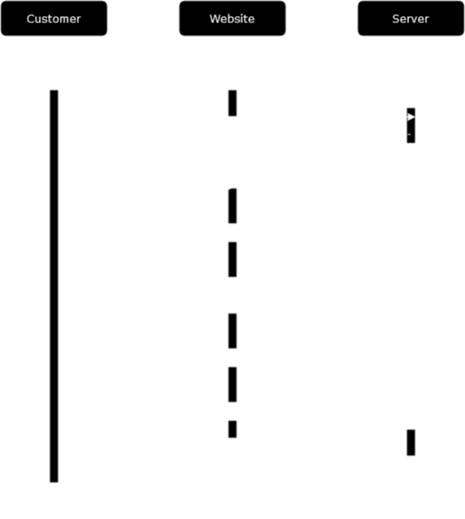
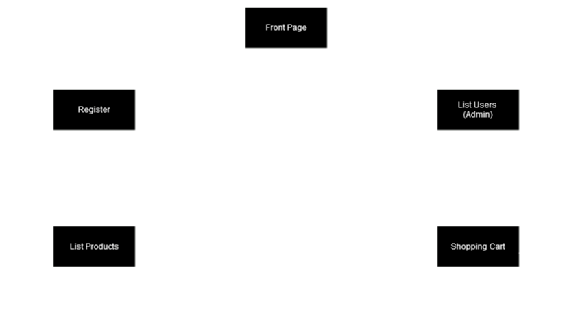

# Welcome to our group's Web Development 1 group work repository

## Group Information

Member1:  Kasper Kivistö, kasper.kivisto@tuni.fi, 50302871, 
responsible for: JSDoc, documentation and development (exept round 11). 

Member2:  Joona Viinikainen, Joona.Viinikainen@tuni.fi, H299863
responsible for: Api development, controllers: users and products, refactoring code.

Member3: Santeri Ora, santeri.ora@tuni.fi, 50118638
responsible for: Api development, controllers: orders and products, refactoring code.

## How To Run The Poject
 
1. Open vagrant
2. Navigate to the project's root directory
3. Run `npm run reset-db` to generate data
4. run `node index.js` to launch the server
5. Go to `localhost:3000` on your browser to use the website

## The Project Plan

The plan was simple. Work when you have the time and inform others when you are working and with what. The general who does what was checked daily.

This plan proved good for us, because all of us had a busy schedule, so locking down a section to one person could have meant that the project was running still while others where free and could have worked that part.

## Node Project Structure
### Project Structure

Below is the general structure of the project code:
 
- src/(Source Code)
   - public (frontend)
      - css
      - js
         - adminUsers.js
         - cart.js
         - products.js
         - register.js
         - utils.js
       - 404.html
       - cart.html
       - index.html
       - products.html
       - register.html
       - users.html
   - controllers (backend)
      - orders.js
      - products.js
      - users.js
   - models (backend)
      - db.js
      - order.js
      - product.js
      - user.js
   - utils 
      - render.js
      - requestUtils.js
      - responseUtils.js
      - users.js
   - test
      - ...

The project uses the Model View Controller (MVC) software design pattern. It is a very common and widely used design pattern that divieds the program logic to three parts, for easier working and maintaining. 

Here is a rundown what everything holds insinde:
- public
   - Public hold most of the frontend code (view) inside ex. html scenes and .js files. These files can be run in the client side.
- controllers
   - Controllers hold the code to interact with the view. It is the middle hand in the program to talk with the view and model. 
- models
   - Models hold the data structures for each data type ex. users and products. When we want want to save or interact with data we use these models to manipulate the Information.
- utils
   - Utils are general utilization tools in the code that are used throughout the code. These help us format the Information to be sent and with what status codes.
- tests
   - Lastly the tests foldes hold all the the test made for this program. In here there are the given tests as also our own written tests. 

### UML Diagrams

Below is the basic sequence UML diagram for customer:

## Pages And Navigation

Below is a freeform diagram showing the pages and navigation within the site:

The diagram shows the main navigation in the site. The main thing to take from this is that the site has a navigation bar at the top so the user can jump between all the pages from anywhere in the site. 

## Data Models

Below is descibed the data models used in the project work. 

- User
   - File: models/user.js.
   - Attributes: ID (MongoDB constructed), Name (string), Email (string), Password (hashed).
   - Purpose: Represents a registered user.
   - Connections: Orders (one-to-many).
- Product
   - File: models/product.js.
   - Attributes: ID (MongoDB constructed), Name (string), Description (string), Price (Number), Image (string).
   - Purpose: Represents a product in the webstore.
   - Connections: Order (many-to-one)
- Order
   - File: models/order.js.
   - Attributes: Customer ID (MongoDB constructed), Items (array of products).
   - Purpose: Represents a user's order.
   - Connections: User (many-to-one), Product (one-to-many)

## Security concerns

Cenzic informs in their 2014 security report that 96% of web applications have vulnerabilities.
| Share | Vulnerability |
| ------ | ------ |
|  25%   |    Cross-Site Scripting (XSS)    |
|  23%   |  Information Leakage  |
|  15%   |  Authentication and Authorization |
|  13%   | Session Management  |
|  11%   |  Other   |
|  7%    |  SQL Injection  |
|  6%    |  Cross-Site Request Forgery (CSRF)  |

In the course slides the common security threats represented were:
- User input
- Cross-Site Scripting (XSS)
- Session hijacking
- Cross-Site Request Forgery
- SQL injection
- Directory traversal
 	
Our project work is no exeption. We have tried mitigating them so our site would be safe, but beacuse none of us is a security or web application expert, there propably will be vulnerabilities that we didn't see or know about. The three main things we have done, that where also represented in the course sildes are: same-origin policy, Cross-Origin Resource Sharing (CORS) and Content Security Policy (CSP). We also have done some smaller things, trying to increase security, such as hashing the user password and not saving it directly. 
 	

## Testing

Testing of the project was made with automated tests and user testing. The testers used where moslty provided by course personel and the tester included tests for Mocha grader, JSDoc grader, ESlint grader and ESlint functional programming grader. In additing the last test combined all these testers and also our own test.

- To run the tests use `npm test`.

| GitLab issues | Mocha test | Test file |
| --- | --- | --- |
| [getAllProducts() implementation](https://course-gitlab.tuni.fi/webdev1-fall-2023-groupwork/webdev1-fall2023-group045/-/issues/7)    | getAllProducts() | test/own/product.test.js |
| [getAllUsers() implementation](https://course-gitlab.tuni.fi/webdev1-fall-2023-groupwork/webdev1-fall2023-group045/-/issues/8)       |  getAllUsers()   | test/own/user.test.js |
| [viewUser() implementation](https://course-gitlab.tuni.fi/webdev1-fall-2023-groupwork/webdev1-fall2023-group045/-/issues/9)          |  viewUser()      | test/own/user.test.js |
| [deleteUser() implementation](https://course-gitlab.tuni.fi/webdev1-fall-2023-groupwork/webdev1-fall2023-group045/-/issues/10)       |  deleteUser()    | test/own/user.test.js |
| [updateUser() implementation](https://course-gitlab.tuni.fi/webdev1-fall-2023-groupwork/webdev1-fall2023-group045/-/issues/11)       | updateUser()     | test/own/user.test.js |
| [registerUser() implementation](https://course-gitlab.tuni.fi/webdev1-fall-2023-groupwork/webdev1-fall2023-group045/-/issues/2)      |  registerUser()  | test/own/user.test.js |
| [Setting up the GitLab Cl pipeline](https://course-gitlab.tuni.fi/webdev1-fall-2023-groupwork/webdev1-fall2023-group045/-/issues/3)  |                  |  |
| [Testing GitLab Cl pipeline](https://course-gitlab.tuni.fi/webdev1-fall-2023-groupwork/webdev1-fall2023-group045/-/issues/4)         |                  |  |
| [Funtional programming](https://course-gitlab.tuni.fi/webdev1-fall-2023-groupwork/webdev1-fall2023-group045/-/issues/6)              |                  |  |
| [Mocha test cases for GitLab issues](https://course-gitlab.tuni.fi/webdev1-fall-2023-groupwork/webdev1-fall2023-group045/-/issues/1) |                  |  |

